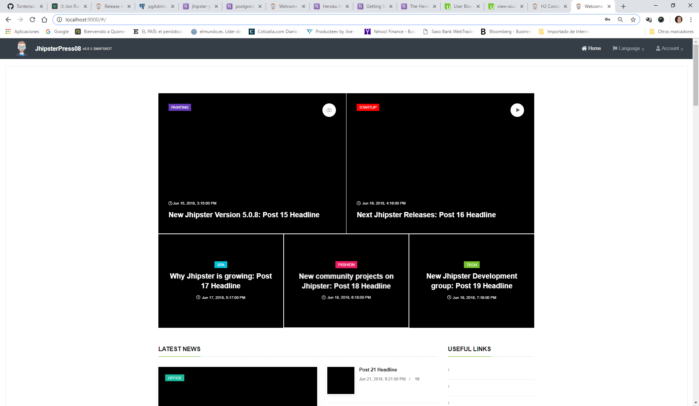

# LEARNING PROJECT: http://www.spingular.com/ (formerly jhipsterpress)

First, I would like to thank Jon Rudell (https://github.com/ruddell). Without his help, http://www.spingular.com/ would not have been possible! **Note that it takes +30 seconds to wake up http://www.spingular.com/ in Heroku free account**.



When I started, I wanted to make an App that helped me (and hopefully others) to learn Jhipster and, at the same time, that would become an interesting project that could grow over time with different parts. This project is a live example of the solutions that are difficult to find elsewhere and you can see them in a working App. Check the Starting Point for a list of examples.

I thought about it as a collaborative project that should be interesting for other developers to join, at any point (you can mail me at spingular@gmail.com), either because you wanted to learn how we have done it (beginners) or propose new ideas to make it grow and excel. Moreover, you can download the App and create your own Website if you wish to do so.

The App is the combination of several sub-apps or parts: a newspaper with a blog and a meeting site (or grouping site). Let's start with a brief description of each part:

-   Newspaper: The admin can manage the FrontPage of the site placing news that he considers interesting. This news can be general news, or specific ones about main interests or activities that are important for him or his gorup. A profile or a group can have a Blog, post news and users can comment those posts that would be grouped with tags and topics that are related with the interests and activities of the meeting site.
-   Meeting site: A user can fill a profile detailing the activities or interest he has. He can follow other user with similar tastes, activities or sports, to join groups that meet together. A user, or group profile, can upload an Album with photographs. A profile can also receive messages and notifications.

-   WIP: Proposals: Think of a proposal as a general idea. A user thinks about something that wants to present to other users for consideration, so he fills a proposal. This proposal could be explained in a Post and it can be voted by other users, a group or the general visitor.
-   WIP: Bulletin Board: will be used to post offers and demands for things or services.
-   Other ideas: I have a few more ideas, but first I would like to start with the ones already mentioned here.

## Starting point of the staircase.

I'm not a programmer (actually I have a BA degree but always fascinated by computers), so I have the point of view of the inexperienced.

I learned Spring (thanks to a great teacher: John Purcell https://caveofprogramming.com/) and Angular (with a course from Maximilian Schwarzmuller: https://www.udemy.com/the-complete-guide-to-angular-2/). Then I learned Jhipster with these books:

-   The JHipster Mini-Book 4.5 by Matt Raible. Now with a chapter on microservices!
-   Full Stack Development with JHipster by Deepu K Sasidharan and Sendil Kumar. Get it on Packt and Amazon. https://www.safaribooksonline.com/library/view/full-stack-development/9781788476317/ A must read cause I'm going to explain things that are not fully enough covered there.

Finally, I learned kubernetes with this great course created by Richard Chesterwood https://www.udemy.com/kubernetes-microservices

So this is the first step of the staircase. Anyone who reads these books should have, at least, the same level as I have. We should offer examples and solutions for the problems that are not covered in the books or the courses.

To get an idea of the entities and fields start by taking a look and understanding the JDL file: /src/main/scripts/raro.jh

Let me give you some examples. These might be a problem for:

STARTERS:

-   [How to import your project in STS Maven - Gradle:](ReadMe/Solution12.md)
-   [How to import a template like UNIFY for your project:](ReadMe/Solution14.md)
-   [How to allow HTML code inside a text field:](ReadMe/Solution15.md)
-   [How to allow access to content for visitors in some static pages like the home:](ReadMe/Solution29.md)
-   [How to add static pages to the project:](ReadMe/Solution27.md)
-   [How to show/hide information in the frontend depending on the user Role:](ReadMe/Solution16.md)
-   [How to open access to the REST Api:](ReadMe/Solution1.md)
-   [List screen shows only user�s data:](ReadMe/Solution2.md)
-   [Create a new Authority:](ReadMe/Solution9.md)
-   [How to connect PGAdmin4 to Heroku:](ReadMe/Solution10.md)
-   [How to configure the confirmation email in Heroku:](ReadMe/Solution11.md)
-   [How to add a new font-awesome icon:](ReadMe/Solution26.md)
-   [Project miscelanea:](ReadMe/Solution25.md)

BEGINNERS:

-   [How to avoid unauthorized calls to the API:](ReadMe/Solution17.md)
-   [How to change H2 Database from In-memory to Disk:](ReadMe/Solution5.md)
-   [How to change DTOs to load entities:](ReadMe/Solution18.md)
-   [How to change DTOs to load attributes of other entities:](ReadMe/Solution19.md)
-   [How to change DTOs to load attributes of not related entities:](ReadMe/Solution20.md)
-   [Translations: Text and Enums:](ReadMe/Solution7.md)
-   [Entity with double relation to another entity:](ReadMe/Solution8.md)
-   [How to put logic inside an observable:](ReadMe/Solution23.md)
-   [How to omit a dropbox when not needed in the forms:](ReadMe/Solution32.md)
-   [How to get dates automatically inserted in your forms:](ReadMe/Solution36.md)

INTERMEDIATE:

-   [How to change DTOs with MapStruct:](ReadMe/Solution6.md)
-   [How to use Filtering to show user's data only:](ReadMe/Solution3.md)
-   [How to create completely new component pages on the frontend: Follows and BlockedUser case:](ReadMe/Solution21.md)
-   [How to create the FrontPage for spingular:](ReadMe/Solution22.md)
-   [How to combine two entities together: Post and Comments:](ReadMe/Solution24.md)
-   [Cascade deletion:](ReadMe/Solution28.md)
-   [Cascade deletion in Many2Many relationships:](ReadMe/Solution33.md)
-   [How to enable scrollPositionRestoration:](ReadMe/Solution31.md)
-   [How search for different items simultaneously using Swagger:](ReadMe/Solution37.md)
-   Different ways to block un-authorized code

ADVANCED:

-   [How to manually add relationships to the User Entity:](ReadMe/Solution30.md)
-   [Many-to-Many: How the order of factors does alter the product:](ReadMe/Solution35.md)
-   More will be added.... (if you ask for any)

SPECIFIC or not so general questions:

-   [Configurations and Open Source incompatibilities NOTE](ReadMe/Solution38.md)
-   [How to sanitize YouTube links in Angular 7: DomSanitizer](ReadMe/Solution34.md)

Do you already use this simple tool:https://www.diffchecker.com/diff?

# DOWNLOAD & DATA INSERTIONS:

Once you download and follow the JHipster instructions, you will need to fill the database with data. Use the InsertsInPOSTGRESQLDatabaseV?BLANK.txt file in the root path with your H2 database and restart the App.

# REGULAR JHIPSTER INFO

## Jhipster Version: spingular

This application was generated using JHipster 5.7.0, you can find documentation and help at [https://www.jhipster.tech/documentation-archive/v5.7.0](https://www.jhipster.tech/documentation-archive/v5.7.0).

## Development

To start your application in the dev profile, simply run:

For further instructions on how to develop with JHipster, have a look at [Using JHipster in development][].

### Using angular-cli

You can also use [Angular CLI] to generate some custom client code.

For example, the following command:

    ng generate component my-component

will generate few files:

    create src/main/webapp/app/my-component/my-component.component.html
    create src/main/webapp/app/my-component/my-component.component.ts
    update src/main/webapp/app/app.module.ts

## Building for production

To optimize the spingular application for production, run:

To ensure everything worked, run:

Refer to [Using JHipster in production][] for more details.

## Testing

To launch your application's tests, run:

    ./gradlew test

For more information, refer to the [Running tests page][].

### Code quality

Sonar is used to analyse code quality. You can start a local Sonar server (accessible on http://localhost:9001) with:

```
docker-compose -f src/main/docker/sonar.yml up -d
```

Then, run a Sonar analysis:

```
./gradlew -Pprod clean test sonarqube
```

For more information, refer to the [Code quality page][].

## Using Docker to simplify development (optional)

You can use Docker to improve your JHipster development experience. A number of docker-compose configuration are available in the [src/main/docker](src/main/docker) folder to launch required third party services.

For example, to start a database in a docker container, run:

    docker-compose -f src/main/docker/.yml up -d

To stop it and remove the container, run:

    docker-compose -f src/main/docker/.yml down

You can also fully dockerize your application and all the services that it depends on.
To achieve this, first build a docker image of your app by running:

Then run:

    docker-compose -f src/main/docker/app.yml up -d

For more information refer to [Using Docker and Docker-Compose][], this page also contains information on the docker-compose sub-generator (`jhipster docker-compose`), which is able to generate docker configurations for one or several JHipster applications.

## Continuous Integration (optional)

To configure CI for your project, run the ci-cd sub-generator (`jhipster ci-cd`), this will let you generate configuration files for a number of Continuous Integration systems. Consult the [Setting up Continuous Integration][] page for more information.

[jhipster homepage and latest documentation]: https://www.jhipster.tech
[jhipster 5.7.0 archive]: https://www.jhipster.tech/documentation-archive/v5.7.0
[using jhipster in development]: https://www.jhipster.tech/documentation-archive/v5.7.0/development/
[using docker and docker-compose]: https://www.jhipster.tech/documentation-archive/v5.7.0/docker-compose
[using jhipster in production]: https://www.jhipster.tech/documentation-archive/v5.7.0/production/
[running tests page]: https://www.jhipster.tech/documentation-archive/v5.7.0/running-tests/
[code quality page]: https://www.jhipster.tech/documentation-archive/v5.7.0/code-quality/
[setting up continuous integration]: https://www.jhipster.tech/documentation-archive/v5.7.0/setting-up-ci/
