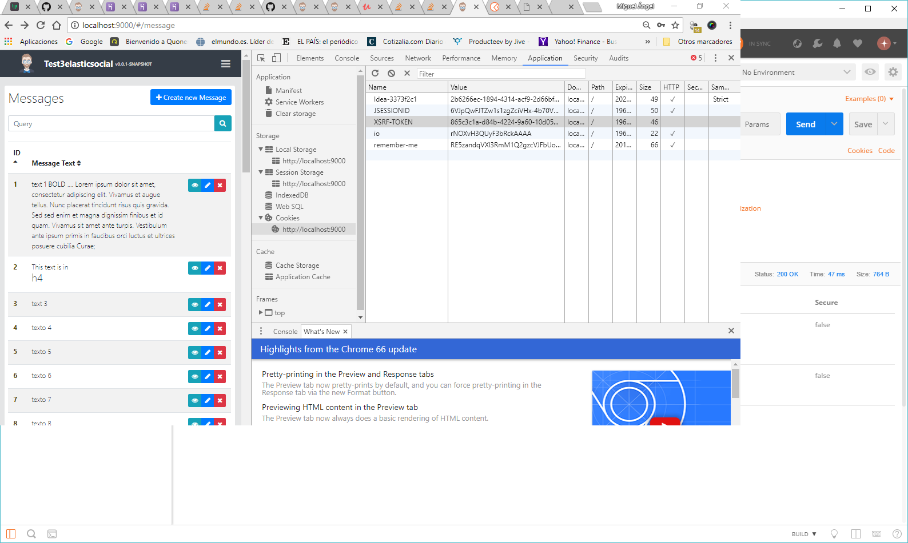
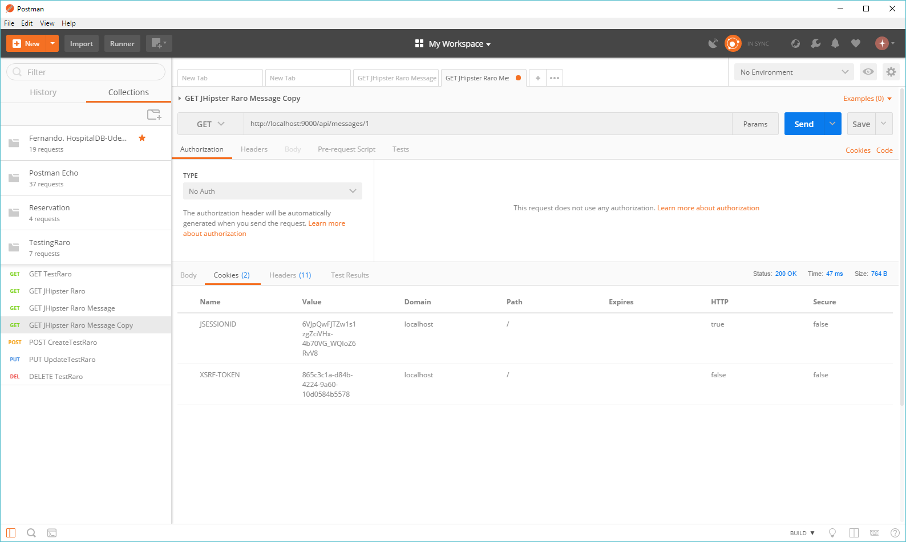
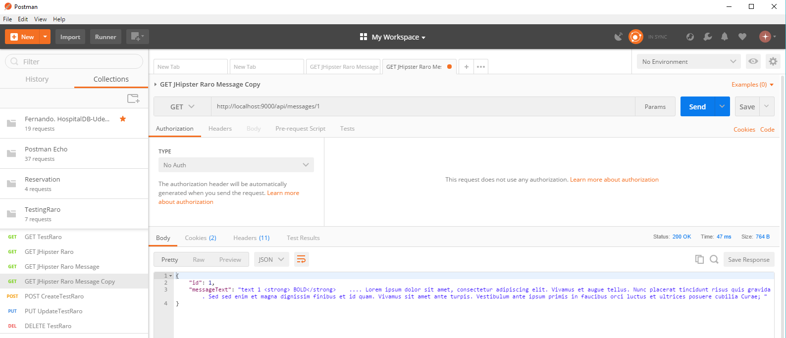

# Problem 1: Open access to the REST Api

Let's open the HomePage to anyone so we can show it like a newspaper (Post object). The FrontPageConfig object has the Posts that we want to show in the Homepage.

TEST THE IDEA:

* First, go the /src/main/java/com/raro/h2skeletonv5/config/SecurityConfiguration.java and open the frontpageconfig api (it should look like this):

        .and()
            .authorizeRequests()
            .antMatchers("/api/register").permitAll()
            .antMatchers("/api/activate").permitAll()
            .antMatchers("/api/authenticate").permitAll()
            .antMatchers("/api/account/reset-password/init").permitAll()
            .antMatchers("/api/account/reset-password/finish").permitAll()
            .antMatchers("/api/profile-info").permitAll()
            .antMatchers(HttpMethod.GET, "/api/frontpageconfigs").permitAll()
            .antMatchers("/api/**").permitAll()
            .antMatchers("/management/health").permitAll()
            .antMatchers("/management/**").hasAuthority(AuthoritiesConstants.ADMIN)
            .antMatchers("/v2/api-docs/**").permitAll()
            .antMatchers("/swagger-resources/configuration/ui").permitAll()
            .antMatchers("/swagger-ui/index.html").hasAuthority(AuthoritiesConstants.ADMIN);
    }
    
Check out Swagger to see any other Api you need to open to the public.

You can also test it from PostMan from http://localhost:9000/api/front-page-configs once your change the (JSESSIONID: CQW9DUWY5-E0gDOUmNugYiNmhimG1-o3_GSA0RqQ) and (XSRF-TOKEN: 99599578-fab8-4aa1-a6c0-fad1cb693ffd) that you will find once you have logged in to JHipster.

You should get you successful answer:

PROCEED:

* 1.- Change your /src/main/webapp/app/home/home.component.ts so it can bring your Data (Frontpageconfig with the desired Posts)
* 2.- Do not forget to delete the authorities: [] array so all user are allowed into the home.route.ts

	export const HOME_ROUTE: Route = {
	    path: '',
	    component: HomeComponent,
	    data: {
	        authorities: [],
	        pageTitle: 'home.title'
	    }
	};
* 3.- Modify your HTML so it can show the data that the components is populating /src/main/webapp/app/home/home.component.html
