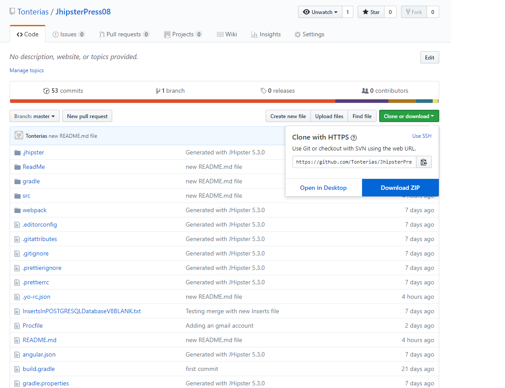
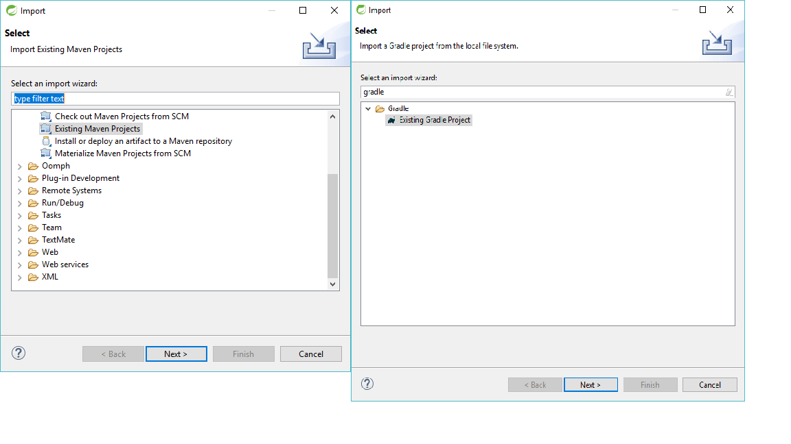

# Problem 12: Importing your project in STS Maven - Gradle

For the very begginer, you should start by downloading the project from GitHub 

 

and importing them as a Maven or Gradle project in your IDE:

Follow the instructions of your IDE or watch one of the many Youtube videos.

https://www.google.es/search?q=how+to+import+maven+project+sts&rlz=1C1EJFA_enES793ES793&source=lnms&tbm=vid&sa=X&ved=0ahUKEwiJtYXxxNbdAhXlqIsKHfyUCwcQ_AUICigB&biw=1038&bih=533

https://www.google.es/search?rlz=1C1EJFA_enES793ES793&biw=1038&bih=533&tbm=vid&ei=T12qW6SWEKGRrgSPm5PwCA&q=how+to+import+gradle+project+sts&oq=how+to+import+gradle+project+sts&gs_l=psy-ab.3..0i8i30k1.31447.33541.0.34099.8.8.0.0.0.0.256.898.0j4j1.5.0....0...1c.1.64.psy-ab..4.4.776...0i8i7i30k1j0i8i13i30k1.0.johYJZU8-5A