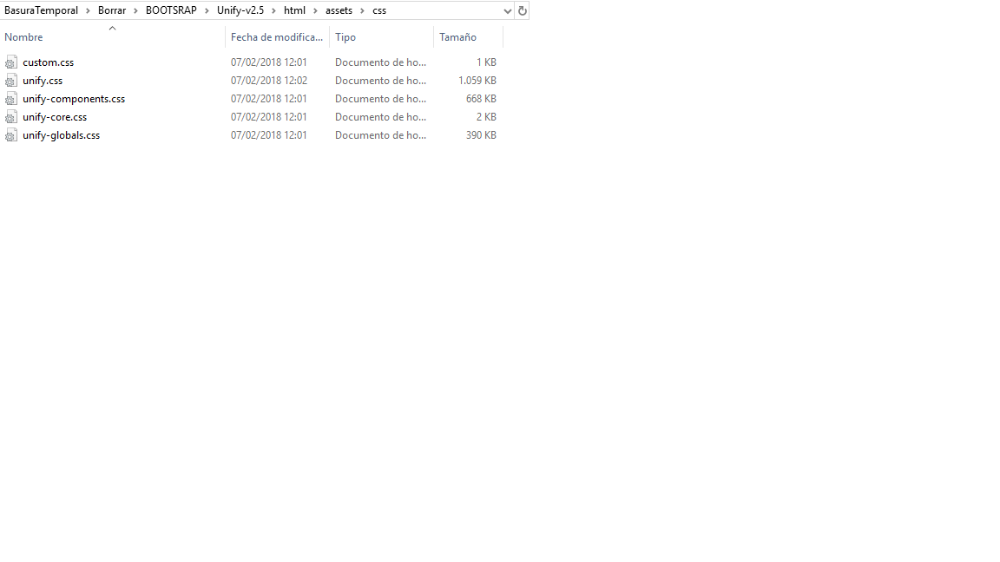
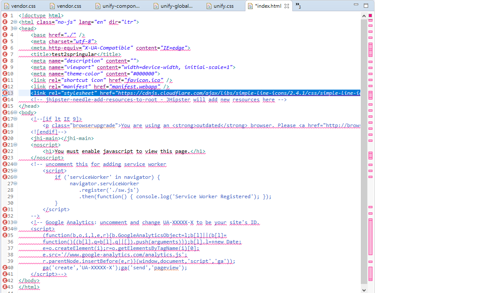

# Problem 14: Importing a template like UNIFY in your project

Using a template like UNIFY can save you tons of hours:

1.	Copy the listed CSS files from (:> Unify-v2.5\html\assets\css) to :>/src/main/webapp/content/css/     folder.

 

... into ...

 

2.	Import unify.css and font-awesome in vendor.css

	/* after changing this file run 'yarn run webpack:build' */
	
	@import '~bootstrap/dist/css/bootstrap.min.css';
	@import '~font-awesome/css/font-awesome.css';
	@import '~font-awesome/css/font-awesome.min.css';
	@import 'unify.css';

You may also install font-awesome in your project using npm or yarn (yarn add font-awesome). You may find this error if they are not correctly installed: 

	Module not found: Error: Can't resolve 'font-awesome/css/font-awesome.min.css' in 	'D:\BasuraTemporal\Borrar\BOOTSRAP\JHispter\Packtpub\skeletonv5\src\main\webapp\content\css'

3.	Copy assets folder (except the css folder) to content/images 

* You may find that some directories are missing (for example: img-temp 230x230, 350x400, 500x650, just copy them)
* I had a separated copy for footer.component.html, home.component.html, main.component.html, since it save me time to just copy them.

4.	Fix all image paths in css with find/replace (yarn will tell you where the path is wrong) 

For example in: home.component.html
INITIAL: ../../../assets/img-temp/500x320/img1.jpg
ENDING:  ../../content/images/img-temp/500x320/img1.jpg

5.- Copy the src/main/webapp/content/css/unify.css you will find in the project.

6.- Add Line Icons CDN to index.html https://github.com/thesabbir/simple-line-icons/

	<link rel="stylesheet" href="https://cdnjs.cloudflare.com/ajax/libs/simple-line-icons/2.4.1/css/simple-line-icons.css">

Follow the instructions of your IDE or watch one of the many Youtube videos.