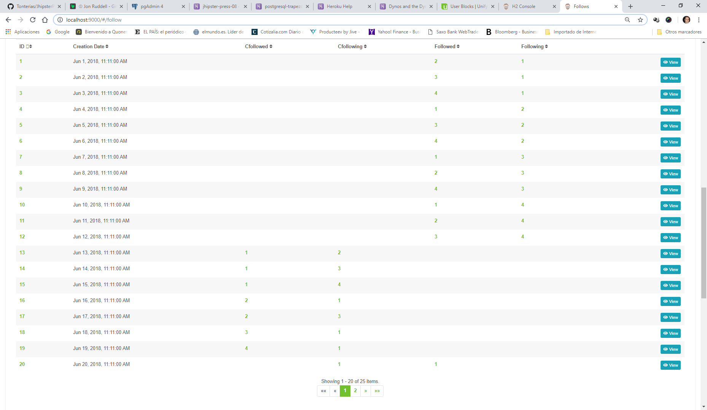

# Problem 21: How to use create new component pages on the frontend: Follows and BlockedUser case

The regular Follow (and BlockUser) entities had to be duplicated into Following and Followers pages (and Blocking and Blocked Users pages).

SELECT * FROM FOLLOW;
ID  	CREATION_DATE  		CFOLLOWED_ID  	CFOLLOWING_ID  	FOLLOWED_ID  	FOLLOWING_ID  
1		2018-06-01 11:11:00	null			null			2				1
2		2018-06-02 11:11:00	null			null			3				1
3		2018-06-03 11:11:00	null			null			4				1
4		2018-06-04 11:11:00	null			null			1				2
5		2018-06-05 11:11:00	null			null			3				2
6		2018-06-06 11:11:00	null			null			4				2
7		2018-06-07 11:11:00	null			null			1				3
8		2018-06-08 11:11:00	null			null			2				3
9		2018-06-09 11:11:00	null			null			4				3
10		2018-06-10 11:11:00	null			null			1				4
11		2018-06-11 11:11:00	null			null			2				4
12		2018-06-12 11:11:00	null			null			3				4
13		2018-06-13 11:11:00	1				2				null			null
14		2018-06-14 11:11:00	1				3				null			null
15		2018-06-15 11:11:00	1				4				null			null
16		2018-06-16 11:11:00	2				1				null			null
17		2018-06-17 11:11:00	2				3				null			null
18		2018-06-18 11:11:00	3				1				null			null
19		2018-06-19 11:11:00	4				1				null			null
20		2018-06-20 11:11:00	null			1				1				null
21		2018-06-21 11:11:00	null			2				1				null
22		2018-06-22 11:11:00	null			3				1				null
23		2018-06-23 11:11:00	1				null			null			1
24		2018-06-24 11:11:00	1				null			null			2
25		2018-06-25 11:11:00	1				null			null			3
(25 rows, 13 ms)

Why? Because a Follow register a Profile or a Community that is being followed by another Profile or a Community

When you want to see the Followers of a Profile (id=1) or a Community you only want to see who is following you, but not yourself (as a logged user). 

It may be easier with an example: Records 1, 2 , 3 & 23 are Profiles 2, 3, 4 & Community 1 who are followers of Profile 1. If we use this follow.component.ts we will have to write code depending on who is calling and will be a mess. I think it is easy to replicate it in the follower.component.html and following.component.html (same for BlockUsers).

So you will also have to create a follower.component.ts and following.component.ts, modify the follow.module.ts file to include them:

	import { NgModule, CUSTOM_ELEMENTS_SCHEMA } from '@angular/core';
	import { RouterModule } from '@angular/router';
	
	import { JhipsterPress08SharedModule } from 'app/shared';
	import {
	    FollowComponent,
	    FollowingComponent,
	    FollowerComponent,
	    FollowDetailComponent,
	    FollowUpdateComponent,
	    FollowDeletePopupComponent,
	    FollowDeleteDialogComponent,
	    followRoute,
	    followPopupRoute
	} from './';
	
	const ENTITY_STATES = [...followRoute, ...followPopupRoute];
	
	@NgModule({
	    imports: [JhipsterPress08SharedModule, RouterModule.forChild(ENTITY_STATES)],
	    declarations: [FollowComponent, FollowingComponent, FollowerComponent, FollowDetailComponent, FollowUpdateComponent, FollowDeleteDialogComponent, FollowDeletePopupComponent],
	    entryComponents: [FollowComponent, FollowingComponent, FollowerComponent, FollowUpdateComponent, FollowDeleteDialogComponent, FollowDeletePopupComponent],
	    schemas: [CUSTOM_ELEMENTS_SCHEMA]
	})
	export class JhipsterPress08FollowModule {}

Add the following and follower route to the follow.route.ts file:

	import { Injectable } from '@angular/core';
	import { HttpResponse } from '@angular/common/http';
	import { Resolve, ActivatedRouteSnapshot, RouterStateSnapshot, Routes } from '@angular/router';
	import { JhiPaginationUtil, JhiResolvePagingParams } from 'ng-jhipster';
	import { UserRouteAccessService } from 'app/core';
	import { of } from 'rxjs';
	import { map } from 'rxjs/operators';
	import { Follow } from 'app/shared/model/follow.model';
	import { FollowService } from './follow.service';
	import { FollowComponent } from './follow.component';
	import { FollowingComponent } from './following.component';
	import { FollowerComponent } from './follower.component';
	import { FollowDetailComponent } from './follow-detail.component';
	import { FollowUpdateComponent } from './follow-update.component';
	import { FollowDeletePopupComponent } from './follow-delete-dialog.component';
	import { IFollow } from 'app/shared/model/follow.model';
	
	@Injectable({ providedIn: 'root' })
	export class FollowResolve implements Resolve<IFollow> {
	    constructor(private service: FollowService) {}
	
	    resolve(route: ActivatedRouteSnapshot, state: RouterStateSnapshot) {
	        const id = route.params['id'] ? route.params['id'] : null;
	        if (id) {
	            return this.service.find(id).pipe(map((follow: HttpResponse<Follow>) => follow.body));
	        }
	        return of(new Follow());
	    }
	}
	
	export const followRoute: Routes = [
	    {
	        path: 'follow',
	        component: FollowComponent,
	        resolve: {
	            pagingParams: JhiResolvePagingParams
	        },
	        data: {
	            authorities: ['ROLE_USER'],
	            defaultSort: 'id,asc',
	            pageTitle: 'jhipsterPress08App.follow.home.title'
	        },
	        canActivate: [UserRouteAccessService]
	    },
	    {
	        path: 'following',
	        component: FollowingComponent,
	        resolve: {
	            pagingParams: JhiResolvePagingParams
	        },
	        data: {
	            authorities: ['ROLE_USER'],
	            defaultSort: 'id,asc',
	            pageTitle: 'jhipsterPress08App.follow.home.title'
	        },
	        canActivate: [UserRouteAccessService]
	    },
	    {
	        path: 'follower',
	        component: FollowerComponent,
	        resolve: {
	            pagingParams: JhiResolvePagingParams
	        },
	        data: {
	            authorities: ['ROLE_USER'],
	            defaultSort: 'id,asc',
	            pageTitle: 'jhipsterPress08App.follow.home.title'
	        },
	        canActivate: [UserRouteAccessService]
	    }, ... CONTINUES ....
    
COMPROBAR SI EL QUERY SE USA EN EL FOLLOW.SERVICE EN LOS TS COMOPONENT O NO

    query(req?: any): Observable<EntityArrayResponseType> {
        const options = createRequestOption(req);
        return this.http
            .get<IFollow[]>(this.resourceUrl, { params: options, observe: 'response' })
            .pipe(map((res: EntityArrayResponseType) => this.convertDateArrayFromServer(res)));
    }
    
    
And add them into the index.ts

	export * from './follow.service';
	export * from './follow-update.component';
	export * from './follow-delete-dialog.component';
	export * from './follow-detail.component';
	export * from './follow.component';
	export * from './following.component';
	export * from './follower.component';
	export * from './follow.route';
	
The backend should not be changed since we will reuse all of its parts.

BUT, the most important part is the follower.component.ts and following.component.ts and its HTML components. See the real files for updates:

/src/main/webapp/app/entities/follow/follower.component.ts

	import { Component, OnInit, OnDestroy } from '@angular/core';
	import { HttpErrorResponse, HttpHeaders, HttpResponse } from '@angular/common/http';
	import { ActivatedRoute, Router } from '@angular/router';
	import { Subscription } from 'rxjs';
	import { JhiEventManager, JhiParseLinks, JhiAlertService } from 'ng-jhipster';
	
	import { IFollow } from 'app/shared/model/follow.model';
	import { Principal } from 'app/core';
	
	import { ITEMS_PER_PAGE } from 'app/shared';
	import { FollowService } from './follow.service';
	
	@Component({
	    selector: 'jhi-follow',
	    templateUrl: './follower.component.html'
	})
	export class FollowerComponent implements OnInit, OnDestroy {
	    currentAccount: any;
	    follows: IFollow[];
	    error: any;
	    success: any;
	    eventSubscriber: Subscription;
	    routeData: any;
	    links: any;
	    totalItems: any;
	    queryCount: any;
	    itemsPerPage: any;
	    page: any;
	    predicate: any;
	    previousPage: any;
	    reverse: any;
	    nameParamFollows: any;
	    valueParamFollows: any;
	
	    constructor(
	        private followService: FollowService,
	        private parseLinks: JhiParseLinks,
	        private jhiAlertService: JhiAlertService,
	        private principal: Principal,
	        private activatedRoute: ActivatedRoute,
	        private router: Router,
	        private eventManager: JhiEventManager
	    ) {
	        this.itemsPerPage = ITEMS_PER_PAGE;
	        this.routeData = this.activatedRoute.data.subscribe(data => {
	            this.page = data.pagingParams.page;
	            this.previousPage = data.pagingParams.page;
	            this.reverse = data.pagingParams.ascending;
	            this.predicate = data.pagingParams.predicate;
	        });

- First, we need two parameters for the followingID (key-value): this.nameParamFollows = 'followingId.equals'; & this.valueParamFollows = params.followingIdEquals; 

	        this.activatedRoute.queryParams.subscribe( params => {
	            if (params.followingIdEquals != null) {
	                this.nameParamFollows = 'followingId.equals';
	                this.valueParamFollows = params.followingIdEquals;
	            }
	            if (params.cfollowingIdEquals != null) {
	                this.nameParamFollows = 'cfollowingId.equals';
	                this.valueParamFollows = params.cfollowingIdEquals;
	            }
	        });
	    }

- Second, we will use to the params to query this.followService.query(query) and
	
	    loadAll() {
	        const query = {
	                page: this.page - 1,
	                size: this.itemsPerPage,
	                sort: this.sort()
	            };
	        query[this.nameParamFollows] = this.valueParamFollows;
	        this.followService
	            .query(query)
	            .subscribe(
	                (res: HttpResponse<IFollow[]>) => this.paginateFollows(res.body, res.headers),
	                (res: HttpErrorResponse) => this.onError(res.message)
	            );
	    }
	
	    loadPage(page: number) {
	        if (page !== this.previousPage) {
	            this.previousPage = page;
	            this.transition();
	        }
	    }
	
	    transition() {
	        this.router.navigate(['/follow'], {
	            queryParams: {
	                page: this.page,
	                size: this.itemsPerPage,
	                sort: this.predicate + ',' + (this.reverse ? 'asc' : 'desc')
	            }
	        });
	        this.loadAll();
	    }
	
	    clear() {
	        this.page = 0;
	        this.router.navigate([
	            '/follow',
	            {
	                page: this.page,
	                sort: this.predicate + ',' + (this.reverse ? 'asc' : 'desc')
	            }
	        ]);
	        this.loadAll();
	    }
	
	    ngOnInit() {
	        this.loadAll();
	        this.principal.identity().then(account => {
	            this.currentAccount = account;
	        });
	        this.registerChangeInFollows();
	    }
	
	    ngOnDestroy() {
	        this.eventManager.destroy(this.eventSubscriber);
	    }
	
	    trackId(index: number, item: IFollow) {
	        return item.id;
	    }
	
	    registerChangeInFollows() {
	        this.eventSubscriber = this.eventManager.subscribe('followListModification', response => this.loadAll());
	    }
	
	    sort() {
	        const result = [this.predicate + ',' + (this.reverse ? 'asc' : 'desc')];
	        if (this.predicate !== 'id') {
	            result.push('id');
	        }
	        return result;
	    }

- Third, paginate the result:
	
	    private paginateFollows(data: IFollow[], headers: HttpHeaders) {
	        this.links = this.parseLinks.parse(headers.get('link'));
	        this.totalItems = parseInt(headers.get('X-Total-Count'), 10);
	        this.queryCount = this.totalItems;
	        this.follows = data;
	        console.log('CONSOLOG: M:paginateFollows & O: this.follows : ', this.follows);
	    }
	
	    private onError(errorMessage: string) {
	        this.jhiAlertService.error(errorMessage, null, null);
	    }
	}

Same thing with Following. Then, in the follower.component.html we show the results:

	

	    <h2 id="page-heading">
	        Followers
	    </h2>
	    <jhi-alert></jhi-alert>
	     
	         
	    <!-- Profile Content -->
		

		  <!-- User Contacts -->
		  

		    

		      <!-- Figure -->
		      <figure class="g-bg-white g-brd-around g-brd-gray-light-v4 g-brd-cyan--hover g-transition-0_2 text-center">
		        

		          <!-- Figure Image -->
		          
	              
		          <!-- Figure Image -->
		
		          <!-- Figure Info -->
	
				  <a *ngIf="follow.cfollowedImage" [routerLink]="['/community', follow.cfollowedId, 'view' ]">
		          	<h4 class="h5 g-mb-5">{{follow.cfollowedCommunityname}}</h4>
		          </a>
		          <a *ngIf="follow.followedImage" [routerLink]="['/profile', follow.followedId, 'view' ]">
		          	<h4 class="h5 g-mb-5">{{follow.followedUserFirstName}} {{follow.followedUserLastName}}</h4>
		          </a>
		        

		
		        

		      </figure>
		      <!-- End Figure -->
		    

		

		<!-- End Profile Content -->
		

	    

	        

	            <jhi-item-count [page]="page" [total]="queryCount" [maxSize]="5" [itemsPerPage]="itemsPerPage"></jhi-item-count>
	        

	        

	            <ngb-pagination [collectionSize]="totalItems" [(page)]="page" [pageSize]="itemsPerPage" [maxSize]="5" [rotate]="true" [boundaryLinks]="true" (pageChange)="loadPage(page)"></ngb-pagination>
	        

	    

	
 
	
	
NOTE: Make sure you updated your FollowDTO & FollowMapper to get all the content that you need to show (the same applies to BlockuserDTO & BlockuserMapper).

May be I should separate the BlockUser.json into 3, but i thought it was easier to put them together since the backend entity is the same:

	
	{
	    "jhipsterPress08App": {
	        "blockuser" : {
	            "home": {
	                "title": "Blockusers",
	                "createLabel": "Create a new Blockuser",
	                "createOrEditLabel": "Create or edit a Blockuser"
	            },
	            "created": "A new Blockuser is created with identifier {{ param }}",
	            "updated": "A Blockuser is updated with identifier {{ param }}",
	            "deleted": "A Blockuser is deleted with identifier {{ param }}",
	            "delete": {
	                "question": "Are you sure you want to delete Blockuser {{ id }}?"
	            },
	            "detail": {
	                "title": "Blockuser"
	            },
	            "creationDate": "Creation Date",
	            "cblockeduser": "Cblockeduser",
	            "cblockinguser": "Cblockinguser",
	            "blockeduser": "Blockeduser",
	            "blockinguser": "Blockinguser"
	        },
	        "blockinguser" : {
	            "home": {
	                "title": "Blocking Users",
	                "createLabel": "Create a new Blockuser",
	                "createOrEditLabel": "Create or edit a Blocking User"
	            },
	            "created": "A new Blocking User is created with identifier {{ param }}",
	            "updated": "A Blocking User is updated with identifier {{ param }}",
	            "deleted": "A Blocking User is deleted with identifier {{ param }}",
	            "delete": {
	                "question": "Are you sure you want to delete Blocking User {{ id }}?"
	            },
	            "detail": {
	                "title": "Blocking User"
	            },
	            "creationDate": "Creation Date",
	            "cblockeduser": "Cblockeduser",
	            "cblockinguser": "Cblockinguser",
	            "blockeduser": "Blockeduser",
	            "blockinguser": "Blockinguser"
	        },
	        "blockeduser" : {
	            "home": {
	                "title": "Blocked Users",
	                "createLabel": "Create a new Blockuser",
	                "createOrEditLabel": "Create or edit a Blocked User"
	            },
	            "created": "A new Blocked User is created with identifier {{ param }}",
	            "updated": "A Blocked User is updated with identifier {{ param }}",
	            "deleted": "A Blocked User is deleted with identifier {{ param }}",
	            "delete": {
	                "question": "Are you sure you want to delete Blocked User {{ id }}?"
	            },
	            "detail": {
	                "title": "Blocked User"
	            },
	            "creationDate": "Creation Date",
	            "cblockeduser": "Cblockeduser",
	            "cblockinguser": "Cblockinguser",
	            "blockeduser": "Blockeduser",
	            "blockinguser": "Blockinguser"
	        }
	    }
	}
		